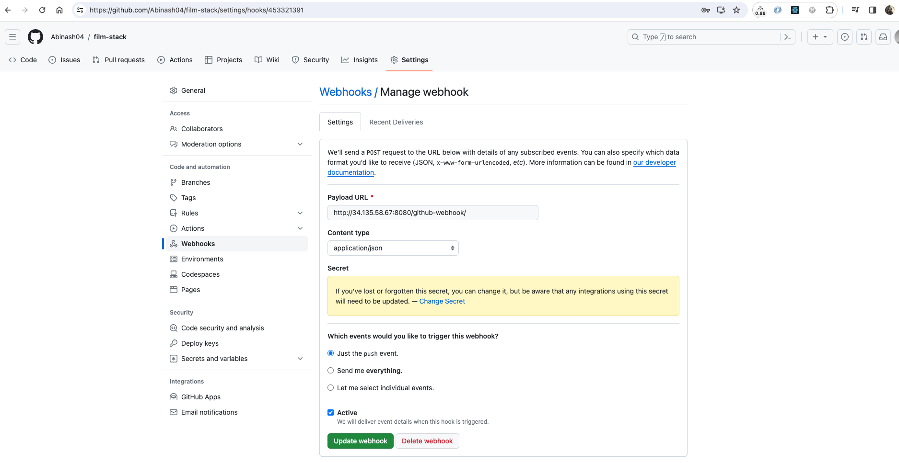

# GCP
Google Cloud Platform Notes

# Basics of Cloud Computing:

## why cloud?
cost of setting up IT infrastructure - huge investment.
Server, switch router, firewall, network, security, storage, etc.
MMC - memory card, if no usage its waste.
Hardware - proper AC room for server, people maintaining them.
**Hypervisor** on top of hardware - instead of OS. it will help in having multiple VMs on the same machine.
Virtualisation - virtual hardware.
Example; VMWare - it helps in giving us the access to multiple VMs installed.
but the hardware should be within reachable i.e. our laptop should be with us so that we can open vmware and access these VMs.

But when we give the access to these VMs on the internet then it becomes the cloud computing where we do not need to be physically present for the hardware to access, all we need is an internet to access them.

Cloud computing is the delivery of computing services 
- servers
- storage
- databases
- networking tool and software over the internet.

  Characteristics of Cloud computing:
  1. On-demand services
  2. Resource pooling 
  3. Elasticity
  4. Broad network access - from any network and device.
  5. Measured services.

### First sample cloud app. hello world deployment for python.
https://first-project-405718.ue.r.appspot.com/

## Important links for GCP certifications
https://www.examtopics.com/exams/google/associate-cloud-engineer/view/9/

## find container IP
docker inspect -f '{{range .NetworkSettings.Networks}}{{.IPAddress}}{{end}}' <container_name_or_id>

## DevOps
WORKDIR does not set the working directory for the rest of the Dockerfile #2282
https://github.com/docker/for-win/issues/2282

## DEMO
Create a VM instance under Compute Engine.
Login to ExternIP , SSH-in-browser.

https://www.youtube.com/watch?v=rzsyj1x54AU&list=PLLu1bCv5AByGUZUl4N2fhZdtHg0pd7G8E&index=2

https://www.digitalocean.com/community/tutorials/how-to-install-jenkins-on-ubuntu-20-04

$ journalctl -u jenkins

Jan 06 18:44:45 gcp-instance-1 systemd[1]: Starting Jenkins Continuous Integration Server...
Jan 06 18:44:45 gcp-instance-1 jenkins[4123]: jenkins: failed to find a valid Java installation
Jan 06 18:44:45 gcp-instance-1 systemd[1]: jenkins.service: Main process exited, code=exited, status=1/FAILURE
Jan 06 18:44:45 gcp-instance-1 systemd[1]: jenkins.service: Failed with result 'exit-code'.
Jan 06 18:44:45 gcp-instance-1 systemd[1]: Failed to start Jenkins Continuous Integration Server.
Jan 06 18:44:45 gcp-instance-1 systemd[1]: jenkins.service: Scheduled restart job, restart counter is at 2.
Jan 06 18:44:45 gcp-instance-1 systemd[1]: Stopped Jenkins Continuous Integration Server.
Jan 06 18:44:45 gcp-instance-1 systemd[1]: Starting Jenkins Continuous Integration Server...
Jan 06 18:44:45 gcp-instance-1 jenkins[4146]: jenkins: failed to find a valid Java installation
Jan 06 18:44:45 gcp-instance-1 systemd[1]: jenkins.service: Main process exited, code=exited, status=1/FAILURE
abinash_behera04@gcp-instance-1:~$ java -version
-bash: java: command not found
abinash_behera04@gcp-instance-1:~$ sudo apt install default-jre

Error:

Job for jenkins.service failed because the control process exited with error code.
See "systemctl status jenkins.service" and "journalctl -xe" for details.
invoke-rc.d: initscript jenkins, action "start" failed.
● jenkins.service - Jenkins Continuous Integration Server
     Loaded: loaded (/lib/systemd/system/jenkins.service; enabled; vendor preset: enabled)
     Active: activating (auto-restart) (Result: exit-code) since Sat 2024-01-06 18:49:12 UTC; 5ms ago
    Process: 5726 ExecStart=/usr/bin/jenkins (code=exited, status=1/FAILURE)
   Main PID: 5726 (code=exited, status=1/FAILURE)
        CPU: 8ms
dpkg: error processing package jenkins (--configure):
 installed jenkins package post-installation script subprocess returned error exit status 1
 
Error Fix:

$ curl -fsSL https://pkg.jenkins.io/debian/jenkins.io-2023.key | sudo tee \
  /usr/share/keyrings/jenkins-keyring.asc > /dev/null
$ echo deb [signed-by=/usr/share/keyrings/jenkins-keyring.asc] \
  https://pkg.jenkins.io/debian binary/ | sudo tee \
  /etc/apt/sources.list.d/jenkins.list > /dev/null

  
https://www.digitalocean.com/community/tutorials/how-to-install-java-with-apt-on-debian-11

Q. how to enable http and https traffic gcp after creating vm?
firewall has moved under network secuirty in GCP

https://www.gcptutorials.com/post/how-to-enable-http-traffic-in-gcp

Create a firewall rule
In VPC network click on Firewall rules
Click "CREATE FIREWALL RULE"
Provide Firewall rule details as listed below.
Name: allow-http-all
Logs: Off
Network: default(or any other network where target vms located)
Priority: 1000
Direction of traffic: Ingress
Targets: All instances in network(this configuration for only dev purpose, in prod specified target tags should be provided)
Source IP ranges: 0.0.0.0/0(this is open to all if you want to restrict access configure IP range accordingly)
Second source filter: None
Protocols and ports: Select Specified protocols and ports
Select tcp and use port 80.
Click-> Create.

Login to externalIP:8080 to login to jenkins
http://34.135.58.67:8080/

Unlock Jenkins
To ensure Jenkins is securely set up by the administrator, a password has been written to the log (not sure where to find it?) and this file on the server:

/var/lib/jenkins/secrets/initialAdminPassword

Please copy the password from either location and paste it below.

Create first admin user. uname/pwd is same.

http://34.135.58.67:8080/ -- jenkins url

Manage jenkins to add ssh agent

Go to Plugins -> Available Plugins -> type ssh -> checkmark SSH Agent-> Install-> Restart Jenkins when installation is complete and no jobs are running

login to jenkins - uname: abinash, pwd=uname

# Create a project locally.
npx create-react-app film-stack
git init (not required as its already done by npx)
git add .
git commit -m "initial commit"
git remote add origin https://github.com/Abinash04/film-stack.git

ab067240@ab067240-mac film-stack % git push -u origin master
Username for 'https://github.com': Abinash04
Password for 'https://Abinash04@github.com': 
remote: Support for password authentication was removed on August 13, 2021.
remote: Please see https://docs.github.com/en/get-started/getting-started-with-git/about-remote-repositories#cloning-with-https-urls for information on currently recommended modes of authentication.
fatal: Authentication failed for 'https://github.com/Abinash04/film-stack.git/'

GitHub Profile-> Settings -> Developer Settings - > Personal access token -> Generate new token (create and save the token as its not going to show up again)

Jenkins build now

Need to install git on the server

sudo apt-get install git - y

abinash_behera04@gcp-instance-1:~$ ls /var/lib/jenkins/workspace/film-stack-pipeline
README.md  package-lock.json  package.json  public  src

We can see the build has created automated git checkout of the repo.

This was done manually in the "Build Now" from jenkins.

We will automate this step so that anytime we push any new changes in the git then it should automatically build in the jenkins.

Go to configure in the jenkins screeen and under General we can see the items which we have already checked mark.
- Do not allow concurrent builds.
- GitHub project 
Project url: https://github.com/Abinash04/film-stack/
and 
- GitHub hook trigger for GITScm polling

Lets make some changes in the master branch and see if the automated build is working or not.
We need to add one more settings in the GitHub for webhook.

In GitHub - Go to project settings in film-stack-> Setting-> Webhooks -> Add webhook

In Jenkins - Go to your profile -> configure -> API Token -> Add New token

Copy this token in the Github webhooks section

Payload URL updated: http://34.135.58.67:8080/github-webhook/ as its giving 403 error.

A crumb is nothing but an access token. Below is the API to get the crumb:

http://34.135.58.67:8080/crumbIssuer/api/json

Response:

{
_class: "hudson.security.csrf.DefaultCrumbIssuer",
crumb: "ec9179ea0967b86ec39fdaa0a27d4df2c87db6223765f8ff2d77df286e87c8a0",
crumbRequestField: "Jenkins-Crumb"
}

Issue can be fixed by below:
Click on Jenkins Dashboard->Manage Jenkins->Security-> under CSRF Protection -> check mark the "Enable proxy compatibility".
